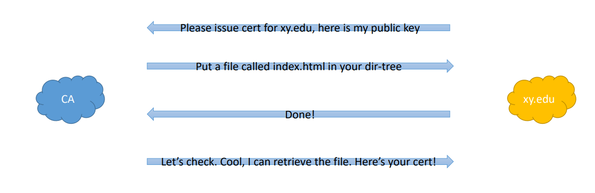
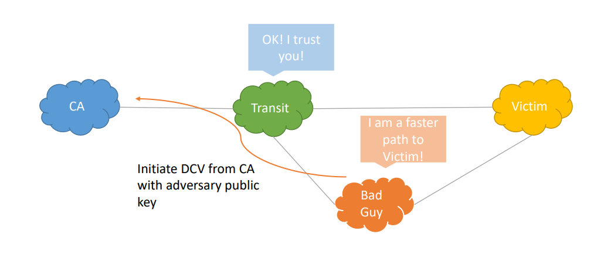

# Computer Security Summary

## Introduction
### Main Security Properties

- **Confidentiality**: Information can only be accessed by authorized individuals. Tools used to enforce confidentiality include:
    - Encryption
    - Access control
    - Authentication (the determination of the identity or role that someone has)
    - Authorization (the determination if a person or system is allowed access to resources)
    - Physical Security (the establishment of physical barriers to limit access to protected computational resources)
- **Integrity**: Data is *untampered*  (information has been changed) and *uncorrupted* (function that uses the data produces a false result). Tools designed to support data integrity include:
    - Backups (the periodic archiving of data)
    - Checksums (the computation of a function that maps the content of a file to a numerical value)
    - Data correcting codes (methods for storing data in such a way that small changes can be easily detected and automatically corrected)
- **Availability**: Both the data and the system that provide access to it are there when you need them. Availability can be provided by the following means:
    - Physical protections (infrastructures meant to keep information available, even in the event of physical challenges)
    - Computational redundancy (computers and storage devices that serve as fallbacls in the case of failures)

Another important security property is **Authenticity**: the certainty that accessed/ received information is actually from the entity we believe it to be from
- a protocol that achieves such types of authenticity demonstrates nonrepudiation (the property that authentic statements issued by some person or system cannot be denied)

### Threat Modeling
Threat modelling attempts to define who the adversary is and what they are trying to do. The following questions should be answered:
- **Who** is the adversary?
- **What** are they allowed to do? Or, what can't we prevent them from doing?
    - The adversary may not be malicious and simply curious
- **What** do we want to prevent the adversary from doing or learning?
    - What is the adversary's aim? When does he win?
- The **set of threats we want to protect against** given this (set of) adversaries
    - When do we win?
    - When does the adversary win?

### Terminology
- **Assets**: Things we want to protect (e.g. hardware, software, information, ...)
- **Vulnerabilities**: Weaknesses in the system that may be exploited
- **Threats**: Cause loss or damage to the sytem, its users, or operators (e.g. if proprietary source code is stolen). The six major categories of threats are: 
    - Interception
    - Interruption
    - Modification
    - Fabrication
    - Repudiation (A repudiation attack happens when an application or system does not adopt controls to properly track and log users' actions, thus permitting malicious manipulation or forging the identification of new actions.)
    - Epistemic ("If I know what you know, then I can harm you.", "Can I get my victim to do a certain thing and hence harm them?")
- **Attack**: An action that exploits a vulnerability to carry out a threat (e.g. hacking the company public facing email server)
- **Controls**: Mitigating or removing a vulnerability

### What is Privacy?
- Concerns individuals and their expectations on how their data, behaviors, and interactions are recorded, utilized, and spread
- A useful definition: "Information self-determination"
    - A person gets to control information about themselves
    - Controls can include:
        - Who gets to see it
        - Who gets to use it
        - What they can use it for
        - Who they can give it to

### What is Trust?
Generally, we trust when we have:
- **Assurance**: The *means to know* that the system is secure
- **Reliability/ Resilience**: To *operate intact* in the face of natural disasters and human-launched attacks
- **Accountability** : The *means to verify* that the system is operating as designed (i.e. securely)

**There is a difference between *trustworthy* and *trusted***

### Security Principles
- **Economy of mechanism**: a mechanism should be easy to understand, verify and maintain
- **Fail-safe defaults**: conservative permissions and functionality
- **Complete mediation**: every access should be checked (again)
- **Open design**: No *security by obscurity*. Security should rely only on keeping cryptographic keys secret. Open design allows for a system to be scrutinized by multiple parties, which leads to the early discovery and correction of security vulnerabilities caused by design errors.
- **Separation of privilege**: cooperation required to act, no single point of failure
- **Least privilege**: programs and users are granted the bare minimum of access
- **Least common mechanism**: minimize the shared means of access to resources
- **Psychological acceptability**: well-designed UI that is intuitive and clean. All security-related settings should adhere to what an ordinary user might expect.
- **Work factor**: comparable effort for the value of the resource
- **Compromise recording**: record failures and breaches

### Common Defence Methods
There are five common defence patterns:
- Prevent
- Deter
- Deflect
- Detect
- Recover

It is a best practice to employ some form of all to obtain **defence in depth**.

### Security Tradeoffs
Can we have secure, privacy-friendly, and trustworthy (*SecPrivTru*) systems?      
Privavy means potentially hiding information; can the system be assured to be safe when it does not know all the data?

**SecPrivTru vs. Cost**
- There is a cost to operating more secure systems. Are the assets worth the effort?
- Are there non-technical solutions that could be employed?

**SecPrivTru vs. Performance**
- There is an overhead to gain *SecPrivTru* properties. How much performance degradation can we tolerate? 
- What properties do we really need?

### How Secure, Private, and Trusted Should it be?
- Attackers usually attack the *weakest link*: an adversary will attack the most vulnerable part of the system, not the one that is easiest to defend for you.
    - This requires *thinking like an attacker*.
    - *Attack trees* and *threat modelling* can be useful tools
- Cost-benefit analysis:
    - Economic incentives: do not spend more on protecting an asset than it is worth.

### Failure of Trust: CA Domain Control Validation

#### BGP Certificate Authority Attacks
1. Adversary announces more specific route to victim domain
2. Intercepts Domain Control Validation message
3. Responds (before the real destination)
4. Gets the certificate issued for victim domain using the private key controlled by adversary  

This is depicted below:

## Network Security: Network Principles
### Network Communication
- Communication in modern networks is characterized by the following fundamental principles:
    - Packet switching
    - Stack of layers
    - Encapsulation