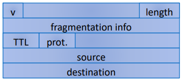

# Computer Security Summary

## Introduction
### Main Security Properties

- **Confidentiality**: Information can only be accessed by authorized individuals. Tools used to enforce confidentiality include:
    - Encryption
    - Access control
    - Authentication (the determination of the identity or role that someone has)
    - Authorization (the determination if a person or system is allowed access to resources)
    - Physical Security (the establishment of physical barriers to limit access to protected computational resources)
- **Integrity**: Data is *untampered*  (information has been changed) and *uncorrupted* (function that uses the data produces a false result). Tools designed to support data integrity include:
    - Backups (the periodic archiving of data)
    - Checksums (the computation of a function that maps the content of a file to a numerical value)
    - Data correcting codes (methods for storing data in such a way that small changes can be easily detected and automatically corrected)
- **Availability**: Both the data and the system that provide access to it are there when you need them. Availability can be provided by the following means:
    - Physical protections (infrastructures meant to keep information available, even in the event of physical challenges)
    - Computational redundancy (computers and storage devices that serve as fallbacls in the case of failures)

Another important security property is **Authenticity**: the certainty that accessed/ received information is actually from the entity we believe it to be from
- a protocol that achieves such types of authenticity demonstrates nonrepudiation (the property that authentic statements issued by some person or system cannot be denied)

### Threat Modeling
Threat modelling attempts to define who the adversary is and what they are trying to do. The following questions should be answered:
- **Who** is the adversary?
- **What** are they allowed to do? Or, what can't we prevent them from doing?
    - The adversary may not be malicious and simply curious
- **What** do we want to prevent the adversary from doing or learning?
    - What is the adversary's aim? When does he win?
- The **set of threats we want to protect against** given this (set of) adversaries
    - When do we win?
    - When does the adversary win?

### Terminology
- **Assets**: Things we want to protect (e.g. hardware, software, information, ...)
- **Vulnerabilities**: Weaknesses in the system that may be exploited
- **Threats**: Cause loss or damage to the sytem, its users, or operators (e.g. if proprietary source code is stolen). The six major categories of threats are: 
    - Interception
    - Interruption
    - Modification
    - Fabrication
    - Repudiation (A repudiation attack happens when an application or system does not adopt controls to properly track and log users' actions, thus permitting malicious manipulation or forging the identification of new actions.)
    - Epistemic ("If I know what you know, then I can harm you.", "Can I get my victim to do a certain thing and hence harm them?")
- **Attack**: An action that exploits a vulnerability to carry out a threat (e.g. hacking the company public facing email server)
- **Controls**: Mitigating or removing a vulnerability

### What is Privacy?
- Concerns individuals and their expectations on how their data, behaviors, and interactions are recorded, utilized, and spread
- A useful definition: "Information self-determination"
    - A person gets to control information about themselves
    - Controls can include:
        - Who gets to see it
        - Who gets to use it
        - What they can use it for
        - Who they can give it to

### What is Trust?
Generally, we trust when we have:
- **Assurance**: The *means to know* that the system is secure
- **Reliability/ Resilience**: To *operate intact* in the face of natural disasters and human-launched attacks
- **Accountability** : The *means to verify* that the system is operating as designed (i.e. securely)

**There is a difference between *trustworthy* and *trusted***

### Security Principles
- **Economy of mechanism**: a mechanism should be easy to understand, verify and maintain
- **Fail-safe defaults**: conservative permissions and functionality
- **Complete mediation**: every access should be checked (again)
- **Open design**: No *security by obscurity*. Security should rely only on keeping cryptographic keys secret. Open design allows for a system to be scrutinized by multiple parties, which leads to the early discovery and correction of security vulnerabilities caused by design errors.
- **Separation of privilege**: cooperation required to act, no single point of failure
- **Least privilege**: programs and users are granted the bare minimum of access
- **Least common mechanism**: minimize the shared means of access to resources
- **Psychological acceptability**: well-designed UI that is intuitive and clean. All security-related settings should adhere to what an ordinary user might expect.
- **Work factor**: comparable effort for the value of the resource
- **Compromise recording**: record failures and breaches

### Common Defence Methods
There are five common defence patterns:
- Prevent
- Deter
- Deflect
- Detect
- Recover

It is a best practice to employ some form of all to obtain **defence in depth**.

### Security Tradeoffs
Can we have secure, privacy-friendly, and trustworthy (*SecPrivTru*) systems?      
Privavy means potentially hiding information; can the system be assured to be safe when it does not know all the data?

**SecPrivTru vs. Cost**
- There is a cost to operating more secure systems. Are the assets worth the effort?
- Are there non-technical solutions that could be employed?

**SecPrivTru vs. Performance**
- There is an overhead to gain *SecPrivTru* properties. How much performance degradation can we tolerate? 
- What properties do we really need?

### How Secure, Private, and Trusted Should it be?
- Attackers usually attack the *weakest link*: an adversary will attack the most vulnerable part of the system, not the one that is easiest to defend for you.
    - This requires *thinking like an attacker*.
    - *Attack trees* and *threat modelling* can be useful tools
- Cost-benefit analysis:
    - Economic incentives: do not spend more on protecting an asset than it is worth.

### Failure of Trust: CA Domain Control Validation

#### BGP Certificate Authority Attacks
1. Adversary announces more specific route to victim domain
2. Intercepts Domain Control Validation message
3. Responds (before the real destination)
4. Gets the certificate issued for victim domain using the private key controlled by adversary  

This is depicted below:


## Network Security: Network Principles
### Network Communication
- Communication in modern networks is characterized by the following fundamental principles:
    - Packet switching
    - Stack of layers
        - Each layer provides a set of services and functionalilty guarantees for higher layers
        - To the extent possible, each layer does not depend on details or services from higher layers
    - Encapsulation

### Packet Switching
- Data is split into *packets*
- Each packet is:
    - Transported *independently* through the network
    - Handled on a *best effort* basis by each device
- Packets may
    - Follow **different routes** between the same endpoints
    - Be dropped by an intermediate device and never delivered

### Stack of Layers
- Network of communication models use a *stack* of *layers*
    - Higher layers use services of lower layers
    - Physical channel at the bottommost layer
- A network device implements several layers
- A communication channel between two devices is established for each layer
    - *Actual* channel at the bottom layer
    - *Virtual* channel at higher layers

The internet stack:
- **Physical Layer**: The task of this layer is to *move the actual bits* between the nodes of the network, on a best effort basis. The abstraction it provides to the next higher layer is an ability to transmit bits between a pair of network nodes.
- **Link Layer**: Transfers data between a pair of network nodes or between nodes in a LAN and to detect errors that occur at the physical layer.
    - E.g. deals with the logical aspects of sending data across network links such as how to find good routing paths.
    - Includes protocols like Ethernet
    - Provides a grouping of bits into ordered records (**frames**)
    - Uses MAC addresses
- **Network Layer** (also called **Internet Layer**): Provides for the moving of packets between two hosts, on a best effort basis
    - Provides a way to individually address each host using a numerical label (its **IP Address**)
    - Main protocol provided by this layer is the **Internet Protocol**
    - **Best effort basis** == There is no guarantee that a packet will be delivered

- **Transport Layer**: Supports communication and connections between applications, based on IP addresses and ports
    - Provides the **Transmission Control Protocol (TCP)**: establishes a virtual connection between a client and server and *guarantees* delivery of all packets in an ordered fashion
    - Provides the **User Datagram Protocol (UDP)**: delivers packages as quickly as possible, but without any delivery guarantees
- **Application Layer**: Provides protocols that support useful functions on the Internet (e.g. HTTP)


.png)

### Encapsulation
- A packet typically consists of: 
    - **Control information**: header and footer
    - **Data**: the *payload*
        - For all but the topmost layer in the stack the *payload* stores a packet of the layer immediately above

- A protocol P uses the services of another protocol Q through **encapsulation**
    - A packet p of P is encapsulated into a packet q of Q
    - The payload of q is p
    - The control information of q is derviced from that of p


Internet Packet Encapsulation:


### Network Interfaces
- **Network interface**: device connecting a computer to a network (e.g. Ethernet card, Wifi adapter, DSL modem)
- A computer may have multiple network interfaces
- Packets transmitted between network interfaces
- Most local area networks (including Ethernet and Wifi) broadcast frames

### Media Access Control (MAC) Addresses
- Most network interfaces come witj a predefined MAC address
- A MAC address is a *48-bit nmuber* usually represented in hex (e.g. 00-1A-92-D4-BF-86)
- The first three octets of any MAC address are IEEE-assigned **Organizationally Unique Identifiers** (e.g. Cisco 00-1A-A1, ASUSTel 00-1A-92).
- The next three can be *assigned by organizations as they please*, with uniqueness being the only constraint

### Switch
- A **switch** performans *routing* in a local area network
    - operates on the link layer
    - has multiple interfaces, each connected to a computer/ segment
- Operation of a switch:
    1. Learn the MAC address of each computer connected to it
    2. Forward frames only to the destination computer


p.230-231  
<span style="color:blue">What is a hub? How is it different from a switch?</span>  
->  

<span style="color:blue">What are disadvantages of hubs?</span>  
->

<span style="color:blue">What are some of the advantages of switches?</span>  
->

#### Combining Switches
- Switches can be arranged into a **tree**
    - Each forwards frames for the MAC addresses of the machines in the segments (subtrees) connected to it
    - Frames to unknown MAC addresses are broadcast
    - Frames to MAC addresses in the same segments as the sender are ignored

<span style="color:blue">How do switch trees work? Why are frames to MAC addresses in the same segments as the sender ignored?</span>  
->


**The Internet**


### Internet Protocol (IP) Functions
- **Addressing**: In order to deliver data, IP needs to be aware of where to deliver data to, and hence includes addressing systems
- **Routing**: IP might be required to communicate across networks, and communicate with networks not directly connected to the current network

- **Fragmentation** and Reassembly: IP packets are carried across networks which may have different maximum packet length


### IP Addresses and Packets
- **IP-Addresses** are 32-bit (IPv4) or 64-bit (IPv6) addresses
    - The address is subdivided into *network*, *subnet*, and *host*
    - There exist *broadcast addresses*, e.g. 128.148.32.255
    - **Private networks** are not routed outside of a LAN
        - 10.0.0.0/8; 172.16.0.0/12
- An **IP-Header** includes: 
    - Source address
    - Destination address
    - Packet length (up to 64KB)
    - Time to live (up to 255)
    - IP protocol version
    - Fragmentation information
    - Transport layer protocol information (e.g. TCP)


p.236-237

<span style="color:blue">In which layer is IP used? What is it used for?</span>

-

### IP Routing
- A **router** bridges two or more networks
    - Operates at the network layer
    - Maintains tables to forward packets to the appropriate network
    - Forwarding decisions based solely on the destination address
- A **routing table** maps ranges of addresses to LANs or other gateway routers  
Routing Example:


### Exploring Internet Routes
- Internet Control Message Protocol (**ICMP**)
    - used for network testing and debugging
    - simple messages encapsulated in single IP packets
    - Considered a network layer protocol
- Tools based on ICMP:
    - **Ping**: sends a series of echo request messages and provides statistics on roundtrip times and packet loss. Verifies if a particular host is receiving messages
    - **Traceroute**: sends series ICMP packets with increasing TTL value to discover routes

p.240-241

<span style="color:blue">Which layer does the ICMP protocol "belong" to? What are its primary functions?</span>  
->

<span style="color:blue">ICMP packets carry various types of messages. What are these types of messages and what is their purpose?</span>  

- 
- 
- 
-


### Network Attacks

Wiretapping (sniffing): Someone other than the intended destination is also receiving the information
Wiretapping (passive): An adversary introduces themselves in the path to the destination (that was not the intended path)
Tampering (active): Information sent by the source, some intermediate node on the path to the destination changes the information
Creation (spoofing): Source never actually sends data, some other source creates information and sends it to the destination, changing the header information so that it looks as if it was sent by the source

### Network Topology
- **Network Topology**: A network's connection structure
- **Host nodes**: The computers in a network, can be sources and destinations of messages
- **Communication nodes**: The routers in a network through which messages flow
- **Local Area Network (LAN)**: A private network composed of computers relatively close to each other
- **Wide Area Network (WAN)**: The internet, many machines and smaller networks spread out over great distances
    - The routers in wide-area networks on the Internet are partitioned into **autonomous systems (ASs)**.
        - Each *AS* is controlled by a single organizational entity, which determines how packets will be routed among the nodes in that AS.

## Network Security: ARP, IP, TCP, UDP
### IP and MAC Addresses
- Devices on a local area network have:
    - **IP** addresses (*network layer*)
        - Used by high-level protocols
    - **MAC** addresses (*data link layer*)
        - Used by low-level protocols

p.232-237

<span style="color:blue">In which layer are MAC addresses used? What are they used for?</span>  

-

### Address Resolution Protocol (ARP)
- Connects the network layer to the data link layer by *mapping IP addresses to MAC addresses*
- Based on broadcast messages and local caching
- **No built in security**: Does not support confidentiality, integrity, or authentication
- Defined as part of **RFC 826 (IETF, Reqiest for Comments)**

p.232-237

<span style="color:blue">In which layer is ARP used? What is it used for?</span>

- 

<span style="color:blue">What are the steps of ARP?</span>

-

<span style="color:blue">Describe the process of ARP spoofing. What makes ARP spoofing possible?</span>

- 

<span style="color:blue">What are common defenses agains ARP spoofing?</span>

-

#### ARP Messages
- ARP broadcasts request of type:
``` 
    Who has <IP addressC>
    tell <IP addressA>
```    
- Machine with <IP addressC> responds:
```
<IP addressC> is at <MAC address>
```
- The requesting machine then *caches the response*
    - ARP caches are stored for a configurable amount of time
- Network administrator configures IP address and subnet on each machine


#### ARP Cache Poisoning (aka ARP Spoofing)
- The ARP table is updated whenever an ARP response is received
- **Requests are not tracked** and **ARP announcements are not authenticated**
- Machines trust each other
- A rogue machine can spoof other machines
- Almost all ARP implementations are stateless
- An ARP cache updates every time that it receives an ARP reply, **even if it did not send any ARP requests**
- Can "poison" ARP cache with **gratuitous ARP replies**
- Using static entries solves the problem but it is almost impossible to manage


### IP Vulnerabilities
- **Unencrypted transmission**
- **No source authentication**
    - Sender can *spoof the source address*, making it difficult to trace packet back to attacker
- **No integrity checking**
    - Entire packet, header and payload, can be modified, enabling *content forgeries, redirections*, and *mal actor-in-the-middle attacks*
- **No bandwidth constraints**
    - Large number of packets can be injected into network to launch a *denial-of-service attack*
    - Broadcast addresses provide additional leverage

p.242-243

<span style="color:blue">What is IP spoofing and what makes it possible?</span>

-

<span style="color:blue">How can IP spoofing be prevented?</span>

-

### User Datagram Protocol
- UDP is a *stateless, unreliable* datagram protocol built on top of IP, i.e. it is at the **transport layer**
- Does not provide delivery guarantees or acknowledgements, making it efficient
- Can distinguish data for **multiple concurrent applications** on a single host
- A lack of reliability implies applications using UDP must be ready to accept a **fair amiznt of corrupted and lost data**
    - Most applications built on UDP will suffer if they require liability
    - VoIP, streaming video, and streaming audio all use UDP

### Transmission Control Protocol
- Transport layer protocol for **reliable** data transfer, **in-order** delivery of messages and ability to distinguish **multiple applications** on same host
    - E.g. HTTP and SSH are built on top of TCP
- TCP is **stateful**: i.e. it keeps track of connection state in memory
- TCP packages a data stream into segments transported by IP
    - Order maintained by marking each packet with a **sequence number**
    - Every time TCP receives a packet, it sends out an acknowledgement (ACK) to indicate successful receipt of the packet
- TCP generally checks data transmitted by comparing a checksum of the data with a checksum encoded in the packet

### Ports
=> This is how we can have many different applications running on the same host
- TCP (& UPD) supports concurrent applications on the same server
- Ports are *16 bit numbers* identifying where data is directed
    - e.g. >telnet 192.168.0.1:80; https://example.co.uk:8080
- The TCP header includes both a source and a destination port
- Ports 0 through 1023 are reserved for *use by known protocols*
    - E.g. HTTPS uses 443 and SSH uses 22
- Ports 1024 through 49151 are known as user ports, and are used for listening to connections

p.246
<span style="color:blue">In which layer is TCP used?</span>

-

<span style="color:blue">How does TCP deal with lost packets?</span>

-


### TCP Data Transfer
- During connection initialization using the three way handshake, initial sequence numbers are exchanged
- The **TCP header** includes a 16 bit checksum of the data and parts of the header, including the source and destination
- ACKS (or the lack thereof) and window size are used by TCP to keep track of packet loss, network congestion, flow control


### Establishing TCP Connections
- TCP connecions are established through a three-way handshake
- The server generally is a *passive listener*, waiting for a connection request
- The client requests a connection by sending out a SYN packet
- The server responds by sending a SYN/ACK packet, acknowledging its connection
- The client responds by sending an ACK to the server, thus establishing connection


<span style="color:blue">How does TCP ensure reliable ordering of future transmissions?</span>

-

### Syn Flooding
Send thousands of SYN requests to the victim
- Alice sendds many SYN packets, without acknowledging any replies. Bob accumulates more SYN packets than he can handle (i.e. he runs out of space in state table)


#### Problems
- Attribution: attacker uses their *own* IP address which could be traced
- Bandwidth: attackker uses their own bandwidth which is likely smaller than a server's

#### Effectiveness
- Effective against a small target
    - Someone running a game server in their home
- Not effective against a large targer (e.g. company website)

### Spoofing: Forged TCP Packets
- Same as SYN flooding, but forge the source of the TCP package
- Advantages:
    - Harder to trace
    - ACKs are sent to a second computer, less attacker bandwidth used
- Problems: 
    - Ingress filtering is commonly used to drop packets with source addresses outside their origin network fragment

### Smurfing (Directed Broadcast)
- The smurfing attack exploits ICMP (Internet Control Message Protocol) ping requests whereby remote hosts respond to echo packets to say they are online
- Some networks respond to pings to broadcast addresses. We call these networks **smurfing amplifiers**
- Idea: Ping a LAN on a broadcast address, then all hosts on the LAN reply to the sender of the ping
- Attack: 
    - Make a forged packet with the victim's IP address as the source
    - Send it to a Smurf amplifier, which then causes a huge number of replies to the victim
- This is a form of **reflection attack** (i.e. using others devices to attack the victim, as opposed to your own devices)


### Distributed Denial of Service (DDos)
A large number of machines work together to perform an attack that prevents valid users from accessing the service

p.256-258

<span style="color:blue">Name three types of DOS attacks. How do they work?</span>

-

<span style="color:blue">How can Smurf Attacks be prevented?</span>

-

<span style="color:blue">How can SYN Flood attacks be prevented?</span>

-

### How Networking Impacts Computer Security Goals
p.227-228
| Goal                | Impact: Is it achieved? Why? Why not?                                             |
| ------------------- | --------------------------------------------------------------------------------- |
| Confidentiality     |                                                                                   |
| Integrity           |                                                                                   |
| Availability        |                                                                                   |
| Assurance           |                                                                                   |
| Authenticity        |                                                                                   |
| Anonymity           |                                                                                   |    

p.253

<span style="color:blue">What is the goal of TCP Sequence Prediction and how does it work? Name the steps of an example attack.</span>

-

## Network Security: Application Layer and DNS

### Application Layer Protocols

Here are some of the common application-layer protocols. What are they used for?

| Protocol | Use |
|----------|-----|
| DNS      |_______________________________________________________________________________________________________________________________________|
| HTTP      |_______________________________________________________________________________________________________________________________________|
| SSL/TLS      |_______________________________________________________________________________________________________________________________________|
| IMAP/POP/SMTP      |_______________________________________________________________________________________________________________________________________|
| FTP      |_______________________________________________________________________________________________________________________________________|
| SOAP      |_______________________________________________________________________________________________________________________________________|
| Telnet      |_______________________________________________________________________________________________________________________________________|
| SSH     |_______________________________________________________________________________________________________________________________________|


### What is a URL?
Uniform Resource Locators (URLs) are a standardized format for describing the location and access method of resources via the internet


Define the term *cyberquatting*/ *domain squatting*.

-


### Domain Name System
In which layer is the Domain Name System used? What are its basic functionalities?

-

What types of resource records does DNS store? 

-


### Domains

- Domain name:
    - Two or more labels, separated by dots (e.g. inf.ed.ac.uk)

- Top-level domain (**TLD**)
    - Generic (**gTLD**), e.g. .com, .org
    - Country-code (**ccTLD**), e.g. .ca, .it
    - New top level domains, e.g. .scot


### Name Servers
What is a name server? What are its main functions?

- 

What is a authoritative name server?

-

What is a root name server?

-

Explain the different parts of a DNS packet,
| Name | Explanation |
|------|-------------|
|header|________________________________________________________________________________________________|
| query part | ________________________________________________________________________________________________|
| answer part | ________________________________________________________________________________________________|
### Name Resolution
What is name resolution? What types of resolution are there?

-

-

-

-

-

-

-


### Glue Records
Circular References: The authoritative name server for a domain may be within the same domain (e.g. dns0.inf.ed.ac.uk is authoritative within inf.ed.ac.uk)

What is a glue record? Why are they useful?

- 

### DNS Caching
There would be too much network traffic if a path in the DNS tree would be traversed for each query: *Root servers and TLD servers would be rapidly overloaded*. 
To solve this, DNS servers *cache* records that are results of queries for a specified amount of time (**Time-to-live field**)

How do DNS queries work with caching?

1.

2.

What are glue records? What problem do they solve?

-


### Local DNS Cache
The OS maintains a DNS cache.
    - shared among all running applications
    - Can be displayed to all users

What privacy issues does this cause?

-

**Note: private/incognito browsing does not clear DNS cache**

### DNS Cache Poisoning
What is the basic idea behind DNS Cache Poisoning?

-

How do DNS queries work? How does this facilitate DNS Cache Poisoning?

-

In which situations can the DNS cache be poisoned?

-

What are some of the defenses against DNS Cache Poisoning?

-

Explain the steps involved in DNS cache poisoning.

1.

2.

3.


### Subdomain DNS Cache Poisoning (Kaminsky)
How do subdomain DNS cache poisonings work?

### Pharming
What is pharming? 

-

Name and explain two pharming attacks.

1.

2.

## Network Security: Firewalls

### Firewalls
What is a firewall?

- Prevent malicious actions from the internet as well as the local network

What is a firewall policy?

-


**Demilitarized Zone**: Portion of the network to which others can connect to this part (e.g. email server) from the internet


Example of fireall policies:


What is a blocklist? What is a allowlist?

- **Blocklist**:

- **Allowlist**:

Explain the different types of firewalls:

- **Packet filters (stateless)**:

    - How does it work?

        -

    - Three-way-handshake:

        1.
        2.
        3.

    - Disadvantage of packet filtering firewalls:

        -


- **Stateful filters**:

    - How does it work?

        -

    - Advantage of stateful firewalls:

        -

    - Three-way-handshake:

        1.
        2.
        3.


- **Application layer**:

    - How does it work?

        -

    - Advantages:

        -

### Port Scanning
- An attacker is looking for applications listening on ports
- A single IP address is contacting many ports to see if any respond

#### Defense
- How can one protect themselves against port scanning?

    -

### Personal Firewalls
- Works on the workstation that it protects (software)
- Provides basic protection, especially for home or mobile devices
- Any rootkit type software can disable the firewall

### Firewalls Pros and Cons

Advantages:

- 

- 

Disadvantages:

-

-

### Network Address Translation
Why do we need NAT?
- We are running out of IP addresses

#### IPv4 and Address Space Exhaustion
- Version 4 of the Internet Protocol
    - of the form 192.168.2.6
- There are less than 4.3 billion IPv4 addresses available
- We do not have enough addresses for every device on the planet

- Answer: **Network Address Translation**
    - Internal IP different than external IP
    - Border router maps between its own IP and the internal ones
- Alternative answer: **IPv6**?

### Intrusion Detection Systems
#### Firewalls are preventative, IDS detects a potential incident in progress
- At some point you have to let some traffic into and out of your network (otherwise user get upset)
- Most security incidents are caused by a user letting something into the network that is malicious, or by being an insider threat themselves.
- These cannot be prevented or anticipated in advance.
- The next step is to identify that something bad is happening quickly so you can address it

#### Rule-Based Intrusion Detection
- Rules identify the types of actions thar match certain known intrusion attack. Rule encode a **signature** for such an attack
- Requires that admin anticipate attack patterns in advance
- Attack may test attack on common signatures
- Impossible to detect a new type of attack
- High accuracy, low false positives

#### Statistical Intrusion Detection
- Dynamically build a statistical model of acceptable or "normal" behavior and flag anything that does not match
- Admin does not need to anticipate potential attacks
- System needs time to warm up to new behavior and to detect behavior
- Can detect new types of attacks
- Higher false positives, lower accuracy
- Must keep up with what "normal" looks like: this can change

#### Base-Rate Fallacy
